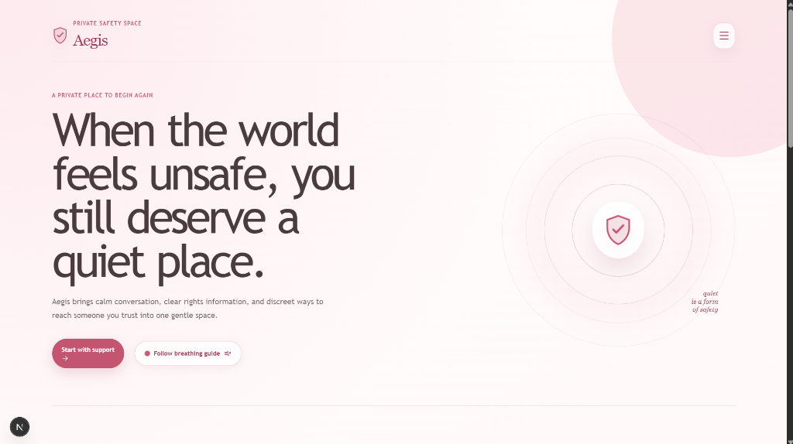
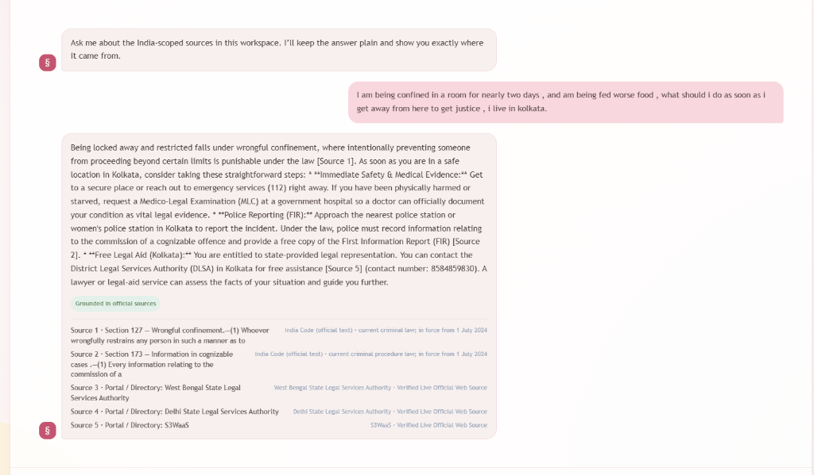
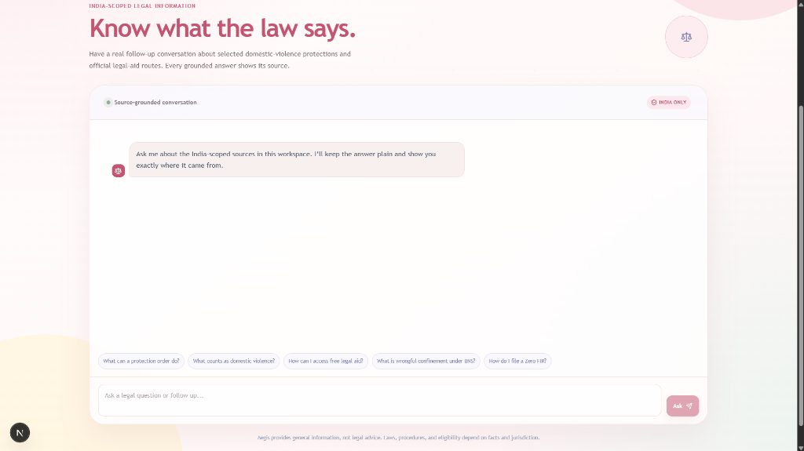
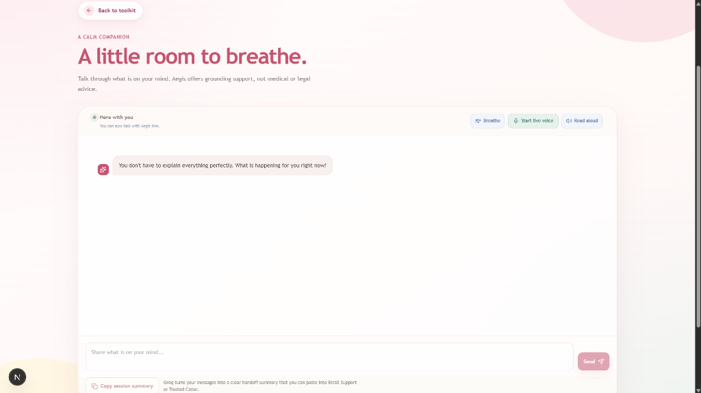
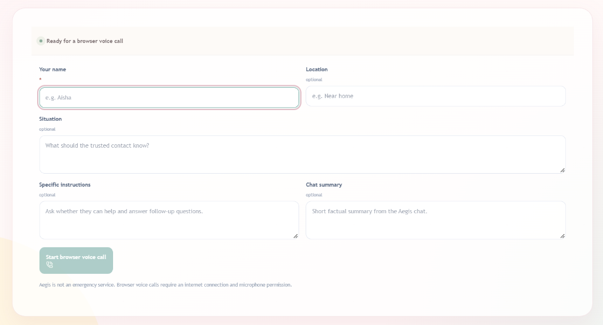
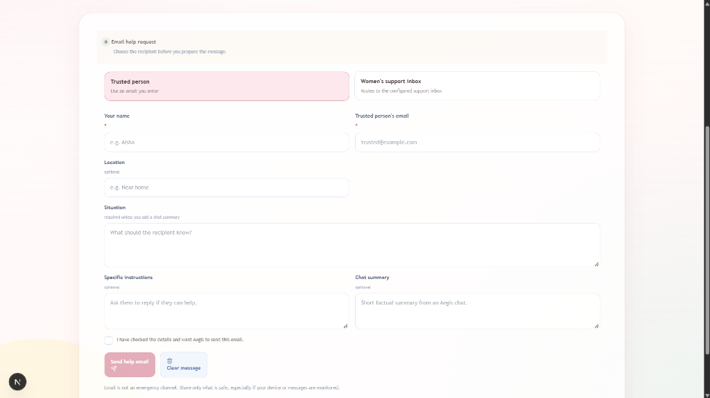

# 🛡️ Aegis: The Stealth Sanctuary

<div align="center">

[](https://opensource.org/licenses/MIT)
[](https://python.org)
[](https://nextjs.org)
[](https://fastapi.tiangolo.com)
[](https://serpapi.com)
[]()

**A covert, zero-trace safety companion and crisis intervention sanctuary disguised as an ordinary calculator.**

<br />



</div>

---

## 🚨 The Problem Statement

For millions of individuals trapped in abusive relationships, domestic violence, or coercive control environments, **reaching out for help is often the most dangerous action they can take.**

* **Digital Surveillance & Coercive Control:** Abusers frequently monitor phones, inspect app lists, read browser histories, and scrutinize call logs. If a victim searches *"how to file domestic violence FIR"* or dials a helpline, the phone record itself triggers immediate, severe retaliation.
* **The "Static Knowledge" Chasm:** Knowing your theoretical rights under the law does not tell you where to go right now. Static legal datasets know what *Section 127 of the Bharatiya Nyaya Sanhita (Wrongful Confinement)* states, but they cannot tell an isolated victim in Kolkata or Pune who their district's Protection Officer is, what the physical address of the nearest **District Legal Services Authority (DLSA)** is, or what verified direct phone number will actually connect them to free legal aid.
* **Cognitive Overload & Panic Paralysis:** In active crises, trauma impedes executive functioning. Victims are confronted by fragmented systems: legal jargon, disconnected helplines, scattered clinics, and overwhelming paperwork.
* **Traceable Communication Trails:** Standard SMS messages and phone calls appear on itemized telecom bills. Even deleted outgoing calls can be retrieved or monitored in real-time through spyware or synchronized cloud accounts.

> **When every second counts and every tap is watched, victims do not just need information—they need absolute deniability, immediate stealth, and verified real-world rescue pathways.**

---

## 🛡️ The Solution: Aegis

**Aegis** is a privacy-first, zero-trace digital sanctuary engineered to provide safe, discrete access to crisis support, legal protection, forensic medical guidance, and emergency signaling.

* **Innocent Calculator Camouflage:** Opens as a fully functioning calculator. No safety branding, no emergency icons, and zero clues to an onlooker. Only entering a secret PIN (e.g., `2580 =`) unlocks the sanctuary.
* **Sub-16ms Panic Switch:** Tapping the `Escape` key or clicking the Quick Exit button instantly flushes in-memory session states, aborts network sockets, and restores the calculator display in under 16 milliseconds.
* **Real-Time Directory Grounding via SerpAPI:** Bridges the gap between statutory law and the physical world by fetching verified, live contact numbers, addresses, and operating hours for local DLSAs, Sakhi One Stop Centres, and government hospitals across India.
* **Invisible Steganographic SOS:** Embeds encrypted GPS coordinates, safe words, and severity metadata into innocent images (e.g., flowers, nature photos) via Lossless Least Significant Bit (LSB) steganography—allowing victims to send covert distress calls in plain sight.
* **Zero-Persistence Privacy Architecture:** High-risk legal queries and blunt medical guides operate strictly in ephemeral memory with zero disk logging. Once the window is closed, all traces vanish permanently.

---

## 👥 Targeted Users

| User Persona | Context & Challenges | How Aegis Protects Them |
| :--- | :--- | :--- |
| **Survivors of Domestic Violence & Coercive Control** | Living with partners or family members who inspect devices, call logs, and browser activity daily. | Calculator camouflage, sub-16ms panic exit, zero browser/device call logs, and steganographic SOS. |
| **Individuals Facing Wrongful Confinement or Crisis** | Restricted from leaving home or cut off from normal social support networks. | India-scoped legal rights RAG bot with live DLSA contacts, offline email queue, and voice bridge. |
| **Minors & Vulnerable Youths** | Seeking urgent advice on health, reproductive concerns, or abuse without fear of judgment. | Age-gated health guidance (minor-safe filtering), zero-memory sessions, and empathetic emotional companion. |
| **First Responders & NGO Case Workers** | Overwhelmed by delayed reports or receiving cryptic distress images from survivors. | Dedicated **Responder Workspace** that instantly decodes steganographic payloads and visualizes severity triage. |

---

## 🔍 Deep Dive: What SerpAPI Does in Aegis

### The Fundamental Limitation of Static RAG

Standard Retrieval-Augmented Generation (RAG) relies on static vector stores containing legal acts like the **Bharatiya Nyaya Sanhita (BNS 2023)** and the **Protection of Women from Domestic Violence Act (PWDVA 2005)**. 

While static RAG accurately explains that *wrongful confinement is punishable under Section 127 BNS*, **it is completely blind to real-world infrastructure**. It cannot tell an abused victim:
1. *"Where is the nearest District Legal Services Authority (DLSA) office located in my city?"*
2. *"What is the actual phone number to reach an assigned Protection Officer right now?"*
3. *"Which government hospital near me conducts a legally valid Medico-Legal Examination (MLC)?"*

### How SerpAPI Bridges the Real-World Gap

Aegis integrates **SerpAPI's Google Search Engine (`engine: "google"`, `gl: "in"`)** to ground legal and health queries with live, verified official Indian institutional sources.

```
       User Legal Query: "I'm confined in a room in Kolkata. What should I do to get justice?"
                                          │
                  ┌───────────────────────┴───────────────────────┐
                  ▼                                               ▼
       Static Legal Vector Store                        SerpAPI Google Engine (gl: "in")
   (BNS, BNSS, PWDVA Curated Acts)               (s3waas.gov.in, districts.ecourts.gov.in)
                  │                                               │
    Section 127 BNS: Confinement law                 DLSA Kolkata Office: 8584859830
    Section 173 BNSS: Zero FIR rights                WB State Legal Services Authority
                  └───────────────────────┬───────────────────────┘
                                          ▼
                            Unified Grounded Response:
         Law + Actionable Steps + Verified Physical Directory & Phone Numbers
```

<div align="center">
  
  <p><em>Real-world response: Statutory BNS/BNSS citations grounded simultaneously with live SerpAPI-retrieved DLSA Kolkata contacts (8584859830) and S3WaaS government portals.</em></p>
</div>

### Privacy-Preserving Search Safeguards

When dealing with domestic abuse, outbound web queries must never leak private data. Aegis wraps SerpAPI inside a military-grade privacy layer:

1. **PII Query Sanitizer (`sanitize_query`):** Pre-processes queries with regex scrubbers to strip survivor names, personal phone numbers, specific apartment addresses, and emotional distress markers before sending the query to SerpAPI. Only clean location + institutional intent strings reach the web.
2. **Domain Whitelist & Forum Blacklist:** Automatically prioritizes verified Indian government portals (`.gov.in`, `.nic.in`, `nalsa.gov.in`, `ecourts.gov.in`) while discarding unverified forums, social media posts, and commercial ads.
3. **In-Memory TTL Caching:** Caches institutional directory queries (e.g., *"DLSA contact Pune"*) in memory with a Time-To-Live. Repeated queries do not produce redundant network footprints.
4. **Graceful Circuit Breaker:** If internet connectivity drops or SerpAPI is unreachable, the system automatically falls back to offline static vector RAG without crashing or displaying suspicious error logs.

---

## ✨ Core Features

### 1. 🧮 Stealth Calculator Disguise & Quick Exit (<16ms)
The initial view is an authentic, fully operable math calculator. 
* Entering `2580` followed by `=` unlocks the Aegis sanctuary.
* Pressing the `Escape` key or clicking **Quick Exit** triggers an immediate hard wipe: in-memory conversation histories are purged, audio/video streams are severed, and the app instantly reverts to `0` on the calculator screen.

---

### 2. 🖼️ Steganographic SOS Distress Beacon
When an abuser is physically present or monitors outgoing texts, sending a standard message is impossible.
* **Lossless LSB Encoding:** Encodes structured emergency payloads—including GPS coordinates, severity levels (Urgent, Moderate, Low), safe words, and contextual notes—into the least significant bits of an innocent cover photo (e.g., a flower or landscape).
* **Undetectable Carrier:** The generated PNG file looks completely normal to the naked eye, passes inspection by spyware or image viewers, and can be shared over WhatsApp, email, or cloud storage without suspicion.

---

### 3. ⚖️ India-Scoped Legal Rights Advisor
Navigating the legal system during an emergency is terrifying. Aegis provides direct, factual answers grounded in Indian legislation:
* **Statutory Corpus:** Pre-indexed with the **Bharatiya Nyaya Sanhita (BNS 2023)**, **Bharatiya Nagarik Suraksha Sanhita (BNSS 2023)**, and **Protection of Women from Domestic Violence Act (PWDVA 2005)**.
* **Explains Actionable Procedures:** Provides step-by-step guidance on filing a **Zero FIR** (Section 173 BNSS), securing Residence and Protection Orders (Section 18 & 19 PWDVA), and claiming free legal representation under NALSA.
* **Live Directory Grounding:** Powered by SerpAPI to retrieve the exact physical address and phone numbers of the user's nearest District Legal Services Authority.
* **Zero Persistence:** Contains no chat memory. As soon as the tab closes, the dialogue is wiped forever.

<div align="center">
  
</div>

---

### 4. 💬 AI Emotional Companion (Trauma-Informed & Consensual Memory)
A gentle, non-judgmental presence designed to assist with de-escalation and panic reduction:
* **Grounding Exercises:** Built-in interactive box breathing guides (`4-4-4-4`) and cognitive defusion exercises.
* **Live Voice & Read Aloud:** Includes browser-native Text-to-Speech (TTS) to read calming responses aloud softly.
* **Consensual Opt-In Memory:** The **only** assistant in Aegis with cross-session recall capabilities—and it is **strictly opt-in**. Memory is turned off by default. It only remembers context if the user explicitly toggles memory ON, giving survivors complete autonomy over their data footprint.

<div align="center">
  
</div>

---

### 5. 🩺 Blunt, Unfiltered Health & Forensic Guide
When experiencing physical trauma, survivors need honest, clinical answers without moral judgment or sugarcoating:
* **Forensic Evidence Preservation:** Explains critical post-assault preservation protocols (preserving clothing unwashed, documenting injuries, obtaining a formal Medico-Legal Examination / MLC at a government hospital).
* **Clinical Health Guidance:** Answers questions on intimate health, reproductive hygiene, contraception, and physical symptoms without euphemisms.
* **Minor Protection Age-Gate:** If the user indicates their age is under 18, the assistant automatically modulates its tone—maintaining clinical accuracy while filtering out graphic or age-inappropriate content.
* **Zero Memory:** Like the legal bot, it preserves zero conversational memory after the session terminates.

---

### 6. 📞 Trusted Caller Voice Bridge
When a survivor cannot safely speak on the phone, Aegis can establish an audio link:
* **Interactive WebRTC Prototype:** Allows the user to initiate a live browser voice session with automated supportive relays.
* **Zero-Trace Production Architecture:** In production deployment, calls are dispatched via an outbound cloud telephony service using a dedicated virtual DID number. Because the call is initiated from the server:
  * **No dialed numbers appear in the victim's phone call history.**
  * **No itemized call records appear on the carrier's telecom billing invoice.**
  * An abuser inspecting the phone sees absolutely zero evidence of a phone call having taken place.

<div align="center">
  
</div>

---

### 7. ✉️ Silent Email Dispatcher with Offline Outbox
Enables survivors to silently queue emergency notifications to trusted individuals or designated women's support centers.
* **Structured Dispatch:** Bundles situation details, safe coordinates, and instructions into clean, pre-configured email templates.
* **Persistent SQLite Queue:** Operates on an offline-first architecture. If the abuser cuts off Wi-Fi or mobile data, the message remains safely queued in a local SQLite outbox and automatically dispatches the moment an internet connection is re-established.

<div align="center">
  
</div>

---

### 8. 🚨 Responder Crisis Workspace
A specialized, authenticated interface built for NGOs, trusted contacts, and crisis teams:
* **Steganography Decoder:** Responders can upload received images to instantly extract hidden distress messages, timestamped GPS coordinates, and victim notes.
* **Severity Triage:** Automatically classifies incoming alerts by urgency to prioritize immediate rescue efforts.

---

## 🏗️ Architecture & Technology Stack

```
┌────────────────────────────────────────────────────────────────────────┐
│                        NEXT.JS 16 FRONTEND                             │
│   React 19 • TypeScript • Tailwind CSS • Clerk Auth • Web Speech API   │
└────────────────────────────────────┬───────────────────────────────────┘
                                     │ HTTP / WebSocket (Port 8123)
                                     ▼
┌────────────────────────────────────────────────────────────────────────┐
│                        FASTAPI BACKEND SERVICE                         │
├────────────────────────────────────────────────────────────────────────┤
│  ┌───────────────────────┐  ┌──────────────────────┐  ┌──────────────┐ │
│  │   Calculator Cloak    │  │ Steganography Engine │  │ Outbox Queue │ │
│  │   & Session Wiper     │  │   (Lossless LSB)     │  │ (SQLite DB)  │ │
│  └───────────────────────┘  └──────────────────────┘  └──────────────┘ │
│                                                                        │
│  ┌───────────────────────────────────────────────────────────────────┐ │
│  │                  HYBRID INTELLIGENCE PIPELINE                     │ │
│  │  • Gemini 2.5 Flash / Groq Llama 3.3 70B (Contextual Generation)  │ │
│  │  • Sentence-Transformers MiniLM-L6-v2 (Local Embeddings)         │ │
│  │  • ChromaDB Vector Store (BNS, BNSS, PWDVA Curated Statutory Law) │ │
│  │  • SerpAPI Engine (Google 'gl:in' Live Legal Aid & Shelter Search)│ │
│  └───────────────────────────────────────────────────────────────────┘ │
└────────────────────────────────────────────────────────────────────────┘
```

* **Frontend:** Next.js 16 (App Router), React 19, TypeScript, Tailwind CSS, Clerk Authentication, Web Speech API.
* **Backend:** FastAPI, Python 3.12, Uvicorn, SQLite (offline persistent outbox).
* **AI & Retrieval:** Google Gemini (`gemini-2.5-flash` / `gemini-1.5-flash`), Groq (`llama-3.3-70b-versatile`), HuggingFace Sentence-Transformers (`all-MiniLM-L6-v2`).
* **Live Search & Grounding:** SerpAPI (Google Search API, India geolocation `gl: "in"`).
* **Steganography:** Custom pure-Python Lossless 24-bit LSB encoding & decoding engine.

---

## 🚀 Startup & Setup Guide

### Prerequisites
* **Python:** Version 3.12 or higher
* **Node.js:** Version 18.x or higher (with `npm`)
* **API Keys:**
  * `SERPAPI_API_KEY` (Required for live legal directory & shelter grounding)
  * `GEMINI_API_KEY` or `GROQ_API_KEY` (For AI chat generation)
  * `CLERK_PUBLISHABLE_KEY` & `CLERK_SECRET_KEY` (For user and responder authentication)

---

### 1. Clone the Repository

```bash
git clone https://github.com/Manthan-cpp/AEGIS-SerpApi-Integrated.git
cd AEGIS-SerpApi-Integrated
```

---

### 2. Backend Setup

Open a terminal (PowerShell on Windows or Bash on Linux/macOS):

```powershell
# Navigate to the backend directory
cd backend

# Create and activate a Python virtual environment
python -m venv .venv

# On Windows:
.venv\Scripts\Activate.ps1
# On macOS/Linux:
# source .venv/bin/activate

# Install required Python dependencies
pip install -r requirements.txt
```

Create your `backend/.env` file (copy from `.env.example`):

```ini
# Gemini API Configuration
GEMINI_API_KEY=your_gemini_api_key_here
GEMINI_MODEL=gemini-2.5-flash

# Groq API Configuration (Optional fallback)
GROQ_API_KEY=your_groq_api_key_here
GROQ_MODEL=llama-3.3-70b-versatile

# SerpAPI Grounding (Live Indian Legal & Shelter Search)
SERPAPI_API_KEY=your_serpapi_key_here

# Local Outbox Configuration
EMAIL_QUEUE_DB_PATH=data/email_queue.sqlite3
EMAIL_QUEUE_WORKER_ENABLED=true

# CORS Configuration
ALLOWED_ORIGINS=http://localhost:3000,http://127.0.0.1:3000
```

Start the backend server on **port 8123**:

```powershell
uvicorn main:app --host 127.0.0.1 --port 8123 --reload
```

---

### 3. Frontend Setup

Open a second terminal window:

```powershell
# Navigate to the frontend directory
cd frontend

# Install Node dependencies
npm install
```

Create your `frontend/.env.local` file (copy from `.env.example`):

```ini
# Backend API Base URL
NEXT_PUBLIC_API_BASE_URL=http://127.0.0.1:8123

# Clerk Authentication Keys
NEXT_PUBLIC_CLERK_PUBLISHABLE_KEY=your_clerk_publishable_key
CLERK_SECRET_KEY=your_clerk_secret_key
NEXT_PUBLIC_CLERK_SIGN_IN_URL=/sign-in
NEXT_PUBLIC_CLERK_SIGN_UP_URL=/sign-up
```

Start the Next.js development server on **port 3000**:

```powershell
npm run dev
```

---

### 4. Verify & Run Test Suite

Run the full automated test suite (all 112 unit and integration tests) to verify system integrity:

```powershell
cd backend
python -m unittest discover -s tests
```

---

### 5. Accessing the Application

1. Open your web browser and navigate to `http://localhost:3000`.
2. You will be greeted by the **Stealth Calculator**.
3. Type `2580` and press `=` to unlock the Aegis Sanctuary.
4. Press `Escape` at any time to test the instant sub-16ms panic exit.

---

## 🔒 Safety & Legal Disclaimer

*Aegis is an assistive safety technology designed to provide educational legal information, trauma-informed emotional grounding, and discreet emergency communication channels. Aegis does not replace formal legal counsel from a licensed attorney, formal medical diagnoses from certified physicians, or official government emergency dispatch services (such as 112 or 181 in India). In situations of immediate life-threatening danger, users are urged to connect with emergency authorities as soon as it is safe to do so.*

---

<div align="center">
  <sub>Engineered with care for privacy, safety, and dignity.</sub>
</div>
